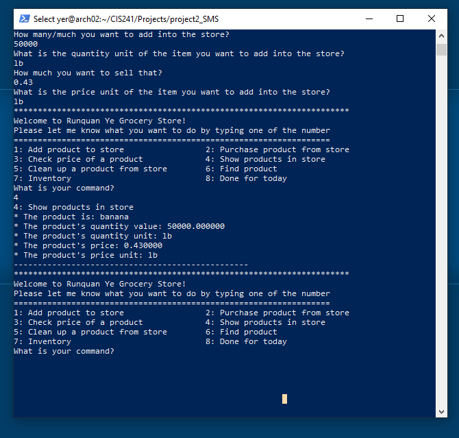

# C
## My C Projects
1. Substitution -Based Cipher
2. Grocery Store Management System
---

## Project 1: Substitution -Based Cipher

Project 1 is an encryption algorithm that is based on substitution and permutation, which knew as a substitution cipher.  The cipher takes a word as the key and encrypts the 26 letters.  Here is more relative information about the [substitution cipher](https://en.wikipedia.org/wiki/Substitution_cipher)

1. I designed this cipher project into two parts:
    + The main.o for running the project
    + The functions.o for the actual relative code for the cipher functionalities.

2. How to run my project:
    + ./a.out    (e/d)     INPUT_KEY_WORD     INPUT_FILE OUTPUT_FILE
        - e refers to Encrypt
        - d refers to decrypt
    + Calling the makefile, by using 'make' in the terminal.  You can just modify the input keyword and input file path to test my projects.

---
## Project 2: Grocery Store Management System

Project 2 is a product management system for the grocery store. It can store, search, and update the product data information and check out products.

<html>
    

        
    

</html>

1. My designed this project into two parts:
    + The main.o for running the project
    + The functions.o for the actual relative code for the management system functionalities.

